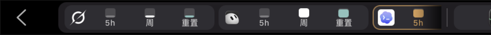
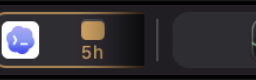
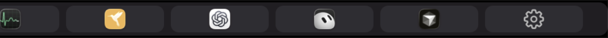
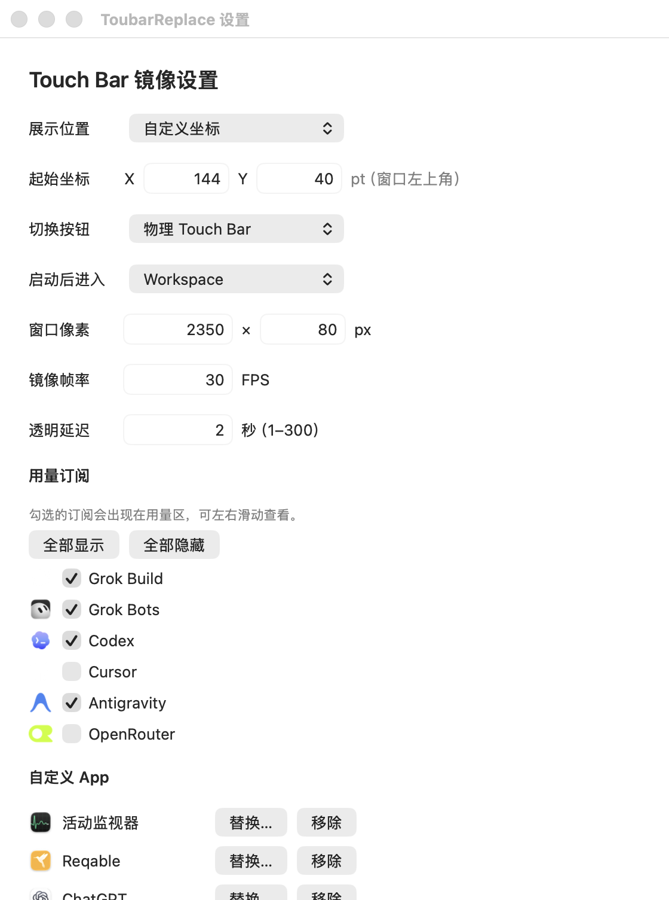

<p align="center">
  
</p>

# ToubarReplace

把 MacBook Touch Bar 做成订阅用量与常用 App 的触控启动台：看还剩多少额度，点一下打开对应应用。带物理 Touch Bar 的机器上，还可以把真实硬件栏镜像到桌面。

官网：<https://toubarreplace.z-agent.ccwu.cc>

> **有物理 Touch Bar**（带栏的 Intel Mac，macOS 14 及以上）：Workspace 出现在物理栏上，桌面窗口镜像当前栏画面。  
> **无可用物理 Touch Bar**（含大多数 Apple Silicon Mac）：启动后默认进入桌面 **软件 Workspace**，条子可直接点；没有系统 Control Strip 的真镜像。是否有物理栏只看系统接口是否可用，不按芯片型号判断。

<p align="center">
  
</p>

---

## 系统要求

- macOS 14 及以上
- Universal（arm64 + x86_64）
- 用量区依赖本机 [OpenUsage](https://github.com/robinebers/openusage)；未安装或暂无快照时显示「暂无额度」
- 打开固定应用时，系统可能询问自动化权限

---

## 安装

### 从安装包安装（推荐）

1. 从[官网](https://toubarreplace.z-agent.ccwu.cc)或 [GitHub Release](https://github.com/CengSin/toubar-replace/releases/latest) 下载 **DMG** / **PKG**。
2. 将 `ToubarReplace.app` 拖入「应用程序」文件夹（PKG 会自动安装到该位置）。
3. 首次打开：若系统提示来自未识别的开发者，可在「系统设置 → 隐私与安全性」中允许打开，或右键图标选择「打开」。
4. 启动后，菜单栏会出现 ToubarReplace 图标（本应用为菜单栏应用，Dock 中默认不常驻）。

### 从源码构建（可选）

```sh
swift build
./.build/debug/ToubarReplace
```

打包为 `.app` / DMG / PKG（尽量打 **arm64 + x86_64** universal；单侧交叉编译失败时回退本机架构）：

```sh
TOUBAR_VERSION=2.0.0 Packaging/build-app.sh
```

产物在 `dist/` 目录。可用 `lipo -info dist/ToubarReplace.app/Contents/MacOS/ToubarReplace` 查看架构切片。

构建、回归测试与实现边界见 [`docs/README-developer.md`](docs/README-developer.md)。仓库根目录的 GitHub Actions 会在 push / PR 时跑 smoke test；打 `v*` tag 或手动运行 **Package** 工作流可打出 DMG / PKG。

---

## 功能概览

默认启动后进入 **Workspace**。设置「启动后进入」可改为镜像。

### Workspace（工作区）

一条栏，两个区：左侧看订阅用量，右侧打开常用 App。有物理栏时呈现在 Touch Bar 上；没有物理栏时画在桌面条上，可直接点击。

<p align="center">
  <br>
  <br>
  
</p>

- **切换**：有物理 Touch Bar 时，设置「切换按钮」可选「物理 Touch Bar」或「独立浮窗」，二者只显示一个。无物理栏时，镜像场景用独立浮窗，Workspace 用条子左侧返回。短按浮窗切换场景，长按或拖动只调整浮窗位置。Workspace 左侧返回可回到镜像。
- **用量区**：读本机 OpenUsage 里每一个带用量的订阅。内置图标覆盖 Grok Build、Grok Bots、Codex、Cursor、Claude、Antigravity、Copilot、OpenCode、Ollama、Devin、OpenRouter；其他订阅也会出现。Cursor 的 Grok Bots 会单独成列。
  - **按量付费（OpenRouter）**：只显示余额金额，缺少余额时回退到剩余额度；不显示短时/周/重置，也不参与到期推荐。柱状与数字模式均显示金额。
  - 周期订阅每列三根竖柱：**5h**（短时额度剩余）、**周**（周/长周期额度剩余）、**重置**（青色；柱高是本周额度周期还剩多少时间，数字是距周额度重置的倒计时）。
  - 没有对应窗口则显示淡空柱。浪费风险最高的订阅描边，对应的 5h 或周柱为琥珀色。
  - 订阅较多时可左右滑动（不画滚动条，右侧会露出下一列）。
  - 设置「用量订阅」可勾选要展示的项，也可用「全部显示 / 全部隐藏」；新发现的默认显示。
  - 点某一列打开对应应用（已固定的自定义 App，或能解析到的 `.app` / 网页）。桌面条上把鼠标停在列上可看完整数字。
  - 数据先读 OpenUsage 的 `127.0.0.1:6736/v1/limits`，失败再跑 `OpenUsage.app` 自带的 `openusage` 命令。
- **应用区**：最多固定 5 个常用 `.app`。空态点「自定义app」、有应用时点右侧齿轮，都打开**设置**；在设置里用「添加应用… / 替换… / 移除」管理。点图标只打开该应用。满员后不会悄悄挤掉已有项。

### 桌面镜像窗口

- 有物理栏时，实时显示当前 Touch Bar 画面（默认 2300×70 像素，可在设置中调整尺寸；帧率跟随系统显示流）。
- 无物理栏且启动进入镜像时，窗口提示「当前 Mac 无物理 Touch Bar」，并说明点击切换按钮打开 Workspace。
- 默认定在屏幕底部；可改为顶部、屏幕中央、上次关闭时的位置，或自定义窗口左上角坐标（AppKit 坐标，单位 pt，Y 轴向上）。
- **镜像场景点击穿透**：鼠标点到窗口会落到背后的应用，窗口本身不能拖动。位置用设置里的展示位置 / 起始坐标调整。软件 Workspace 画在同一窗口里时**可以点击**条子。
- 窗口出现在所有桌面空间。菜单栏「显示或隐藏 Touch Bar」可把这个窗口藏起来或再显示。
- **鼠标进入桌面窗口即变透明**：镜像和 Workspace 浮窗在鼠标进入后立刻变为 30% 不透明，离开后恢复 100%。物理 Touch Bar 本身不改变透明度。
- 镜像窗口不把鼠标坐标映射到物理 Touch Bar；有物理栏时，触控请在栏上完成。

### 设置与菜单

菜单栏图标可打开：

- **显示或隐藏 Touch Bar**：显示或收起桌面窗口
- **设置…**：窗口四边和四角均可调整大小，尺寸会保存（最小约 480×480 点）。可配置：
  - **启动后进入**：Workspace / 镜像
  - **展示位置**：底部（默认）/ 顶部 / 屏幕中央 / 上次关闭时的位置 / 自定义坐标
  - **起始坐标**：自定义位置时的窗口左上角 X / Y（pt）
  - **窗口像素**
  - **切换按钮**：物理 Touch Bar / 独立浮窗（无物理栏时只能用独立浮窗）
  - **区域比例**：滑块调整额度区占比（30%–75%，默认 70%），拖动立即生效并自动保存。
  - **用量订阅**：勾选要展示的项；尚未读到订阅时提示安装 OpenUsage
  - **自定义 App**：添加 / 替换 / 移除，最多 5 个
- **版本**：当前安装版本（不可点）
- **帮助…**：镜像出现 Touch Bar 错误时的 Control Strip 恢复命令
- **退出 ToubarReplace**

打开设置时应用会暂时变为普通前台应用，关闭设置后回到菜单栏模式。

<p align="center">
  
</p>

---

## 使用提示

1. **用量区是空的**  
   请先安装并运行 [OpenUsage](https://github.com/robinebers/openusage)，确认设置「用量订阅」里能读到项目。未安装或暂无快照时显示「暂无额度」。设置里也会提示「还没有读到订阅」。

2. **镜像异常 / 画面全黑或空白**  
   打开菜单栏 **帮助…**，或在终端依次执行：

   ```sh
   defaults delete com.apple.controlstrip FullCustomized
   defaults delete com.apple.controlstrip MiniCustomized
   killall ControlStrip
   ```

   等几秒，显示流会自动重连。

3. **锁屏或睡眠**  
   应用会暂停捕获，并收起物理栏上的 Workspace / 切换按钮。解锁或唤醒后自动恢复；睡眠前若在 Workspace，醒来仍回到 Workspace。无物理栏时，唤醒后重新进入桌面 Workspace。

4. **「App 控制」或「快速操作」下暂时没有可显示内容**  
   镜像会保留最后一帧并给出提示；切换到支持触控栏的 App，或启用一个快速操作后会自动恢复。
